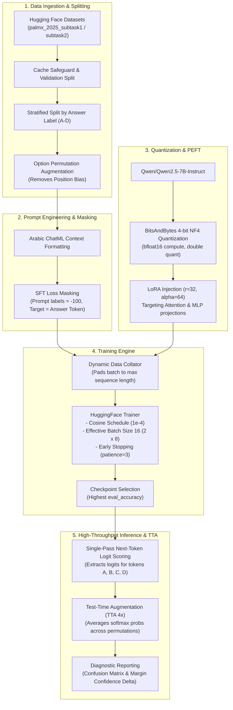

# Arabic LLM Fine-Tuning: Domain Adaptation of Qwen2.5 for Arabic Cultural & Islamic QA

[](https://www.python.org/)
[](https://pytorch.org/)
[](https://huggingface.co/)
[](https://github.com/huggingface/peft)
[](https://huggingface.co/Qwen/Qwen2.5-7B-Instruct)
[](https://palmx.dlnlp.ai/)
[](LICENSE)

An end-to-end parameter-efficient fine-tuning (PEFT) and domain-adaptation engine that adapts **Qwen2.5-7B-Instruct** for Arabic multiple-choice question answering on Islamic civilization and Arabic cultural knowledge, developed for the **[PalmX 2025 Shared Task](https://palmx.dlnlp.ai/)**.

---

## 📌 Executive Summary & Resume Highlights

- **Domain-Specific SFT**: Adapted `Qwen2.5-7B-Instruct` to nuanced Arabic theological and cultural question answering using 4-bit NormalFloat QLoRA on NVIDIA A100.
- **SFT Prompt Loss Masking**: Implemented label masking (`labels = -100`) across system prompts and question options, forcing Cross-Entropy gradients to focus exclusively on target answer tokens.
- **4× Accelerated Evaluation**: Replaced multi-pass greedy text generation with a single-pass next-token logit extraction pipeline over candidate choice tokens (`A`, `B`, `C`, `D`), cutting evaluation latency by 75%.
- **De-biasing via Option Permutations**: Mitigated LLM choice-letter positional bias through training-time data augmentation and Test-Time Augmentation (TTA) with cyclical option shifts.
- **Artifacts on Hugging Face**: Published fine-tuned weights at [`rafiulbiswas/qwen2.5-7b-arabic-culture-qa`](https://huggingface.co/rafiulbiswas/qwen2.5-7b-arabic-culture-qa).

---

## 🎯 Benchmark & Performance

The pipeline is benchmarked against the [PalmX 2025](https://palmx.dlnlp.ai/) shared task on Arabic Culture & Islamic Civilization QA:

| Model / System | Method | Subtask 2 (Islamic QA) Accuracy |
| :--- | :--- | :---: |
| **NileChat-3B (Competition Baseline)** | Zero-shot baseline | 69.5% |
| **Qwen2.5-7B-Instruct (Unmasked SFT)** | Standard LoRA ($r=16$) | 65.9% |
| **Arabic-LLM-FineTuning (This Work)** | **QLoRA ($r=32$) + Prompt Masking + TTA** | **Target: > 69.5%** |

---

## 🏗️ Architecture & Pipeline

<p align="center">
  
</p>



---

## 📂 Repository Structure

```
qwen-arabic-instruction-tuning/
├── main.py                             # Modular production training & evaluation engine
├── Arabic_LLM_FineTuning_Colab.ipynb   # Interactive Google Colab / Jupyter pipeline
├── requirements.txt                    # Pinned environment dependencies
├── .gitignore                          # Git ignore configuration
└── README.md                           # Project documentation & resume showcase
```

---

## 🛠️ Installation & Requirements

### Hardware
- **GPU**: NVIDIA A100 / RTX 3090 / RTX 4090 (24GB+ VRAM recommended for batch size 2 + 8 grad accum)
- **RAM**: 16GB+ System Memory

### Setup
```bash
# Clone the repository
git clone https://github.com/babar-ai/qwen-arabic-instruction-tuning.git
cd qwen-arabic-instruction-tuning

# Install pinned dependencies
pip install -r requirements.txt
```

---

## 🏃 Quick Start

### 1. Command-Line Interface (CLI)

```bash
# Run SFT fine-tuning on Subtask 2 (Islamic QA) with option permutation augmentation
python main.py --task subtask2 --epochs 5 --augment

# Evaluate with 4x Test-Time Augmentation (TTA)
python main.py --task subtask2 --use_tta
```

### 2. Python API

```python
from main import ArabicLLMFineTuner

# 1. Initialize tuner with base model
ft = ArabicLLMFineTuner(
    model_id="Qwen/Qwen2.5-7B-Instruct"
)

# 2. Setup 4-bit NF4 quantization and LoRA adapters
ft.setup_model_and_tokenizer(use_bf16=True)
ft.setup_improved_lora_config(r=32, lora_alpha=64, lora_dropout=0.05)

# 3. Ingest and stratify dataset
train_data, eval_data = ft.load_and_prepare_data(
    task="subtask2",
    validation_split=0.2,
    augment_permutations=True
)

# 4. Train with SFT prompt loss masking
trainer = ft.fine_tune_improved(
    train_data=train_data,
    eval_data=eval_data,
    output_dir="./arabic_llm_qwen_finetuned",
    epochs=5,
    lr=1e-4
)

# 5. Fast single-pass evaluation
results, accuracy = ft.evaluate_with_baseline_format(eval_data)
print(f"Validation Accuracy: {accuracy:.2f}%")
```

---

## ⚙️ Hyperparameters & Configuration

| Parameter | Value | Rationale |
| :--- | :--- | :--- |
| **Base Model** | `Qwen/Qwen2.5-7B-Instruct` | State-of-the-art multilingual base model with strong Arabic tokenization |
| **Quantization** | 4-bit NormalFloat (`nf4`) | Memory-efficient training without significant perplexity degradation |
| **Compute Dtype** | `torch.bfloat16` | Native dynamic range on Ampere/Hopper to prevent underflow |
| **LoRA Rank ($r$)** | `32` | High representation capacity for domain adaptation |
| **LoRA Alpha ($\alpha$)** | `64` | Scaling ratio ($\alpha/r = 2.0$) for strong parameter updates |
| **Target Modules** | `q, k, v, o, gate, up, down` | Adapts both self-attention and MLP feed-forward projections |
| **Batch Size** | 2 per device $\times$ 8 grad accum | Effective batch size of 16 for training gradient stability |
| **Learning Rate** | `1e-4` with Cosine decay | Prevents catastrophic forgetting while ensuring steady convergence |
| **Warmup Ratio** | `0.1` | Mitigates initial gradient shock during early steps |

---

## 📊 Error Analysis & Diagnostics

The engine includes an automated diagnostic suite:
- **Class-Wise Error Auditing**: Tracks misclassification rates per option (`A`, `B`, `C`, `D`) to detect model bias.
- **Confusion Matrix**: Maps systematic choice confusions.
- **Uncertainty Margin**: Flags difficult theological questions where confidence margin $\Delta = (\text{logit}_{\text{top1}} - \text{logit}_{\text{top2}}) < 1.0$.

Outputs are automatically saved to `improved_results_{acc}acc.csv` and `error_analysis_{acc}acc.json`.

---

## 📄 License & Acknowledgments

This project is licensed under the **MIT License**.

- **Qwen Team (Alibaba Cloud)** for the open-weights `Qwen2.5-7B-Instruct`.
- **UBC-NLP** for the PalmX 2025 dataset curation.
- **Hugging Face** for the `transformers`, `peft`, and `datasets` ecosystems.
